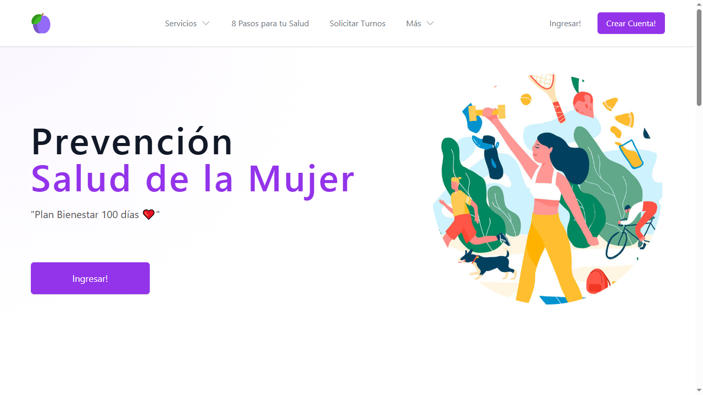

<h1 align="center">Programa Mujer</h1>
<p align="center">A free and open-source healthcare webapp based on Foomedical from the Medplum team.</p>



### Qué es Programa Mujer?

[Programa Mujer](https://mujer.epa-bienestar.com.ar/) es una iniciativa de EPA Bienestar IA donde adaptamos FooMedical de Medplum (Open Source).

### Características

- Free & Open Source
- Seguro y accesible a través del backend en [EPA Bienestar IA](https://app.epa-bienestar.com.ar)
- Registro y Autenticación de Pacientes
- Registros de Salud
  - Resultados de Laboratorio
  - Medicaciones
  - Vacunas
  - Signos Vitals
- Mensajería entre Usuarios/Pacientes y Profesionales/Médicos
- Planes de Atención
- Calendario de consultas
- Todos los datos representados en [FHIR](https://hl7.org/FHIR/)

Mujer está diseñado para "clonar" y "personaliz" según las necesidades de su negogocio. Registro en [Programa Mujer](https://mujer.epa-bienestar.com.ar/register) para ver la demo en acción

### Cómo empezar

Primero, [fork](https://github.com/drdalessandro/mujer/fork) y clone el repositorio.

A continuación, instale la aplicación en su terminal.

```bash
npm install
```

Luego, ejecute la WebApp

```bash
npm run dev
```

Esta aplicación debería ejecutarse en `http://localhost:3000/`

Inicie sesión en la aplicación en localhost y estará listo para comenzar a personalizar.

### Configuración de las cuentas

De forma predeterminada, la aplicación Programa Mujer, se ejecuta localmente y apunta al servicio API en EPA Bienestar IA. Programa Mujer registra las suscripciones.

Para enviar pacientes a su propia organización, deberá contactar al equipo EPA Bienestar IA ([hola@epa-bienestar.com](mailto:hola@epa-bienestar.com)

Solicitar la siguiente información 

- Medplum Project Id
- Google Client Id
- Google Client Secret
- Recaptcha Site Key
- Recaptcha Secret Key


### Importante


